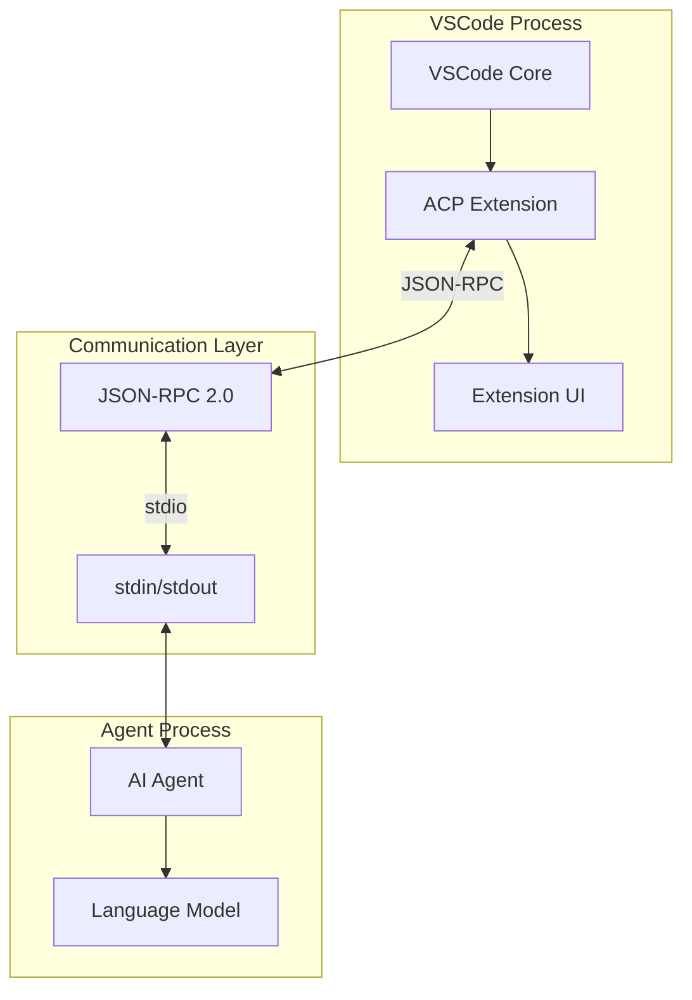
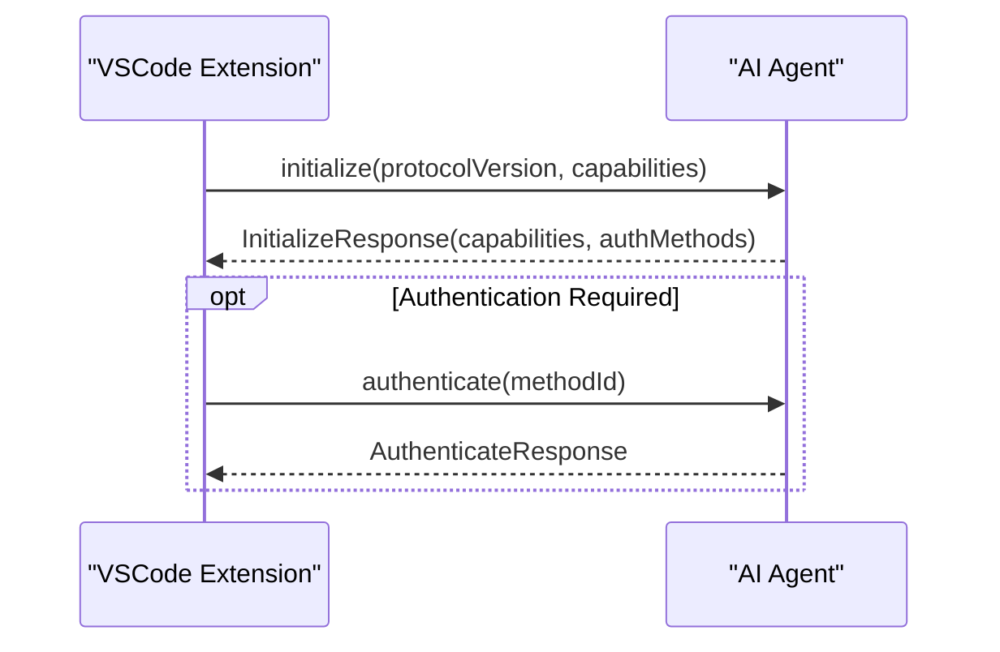
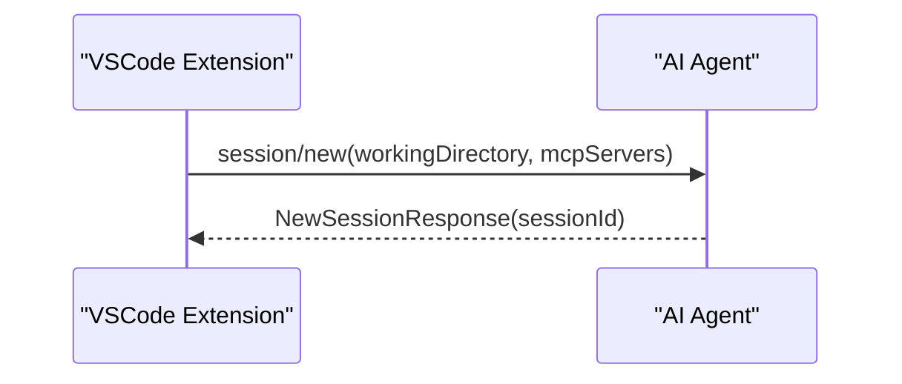
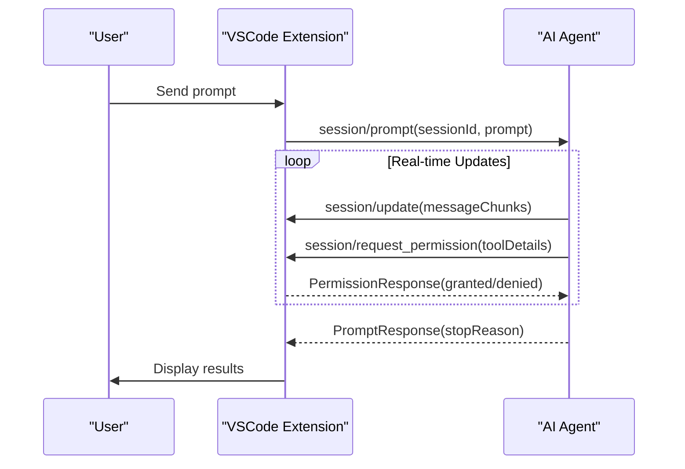

Agent Client Protocol (ACP) 対応 VSCode 拡張機能開発仕様書

## 概要

この仕様書は、Agent Client Protocol (ACP) に対応したVSCode拡張機能の開発のための技術仕様を定義します <cite/>。ACPは、コードエディタとAIコーディングエージェント間の標準化された通信プロトコルです [1](#1-0) 。

本拡張の対象エージェントは「Claude Code（Zed）」を想定します。ACP 準拠の Claude Code エージェント実行ファイル（またはラッパー）を子プロセスとして起動し、標準入出力で JSON‑RPC 通信します。実行ファイルのパス・引数・環境変数は拡張設定から指定します。なお本環境では API キーは不要です。

本環境ではエージェント実行パスの例として `/Users/sotayamashita/.claude/local/claude` を使用します。

## アーキテクチャ概要

### システム構成



ACPは、エディタがクライアント、AIエージェントがサーバーとして動作するクライアント・サーバーアーキテクチャを採用しています [2](#1-1) 。

## プロトコル仕様

### 通信プロトコル

ACPはJSON-RPC 2.0を使用し、stdin/stdoutを通じて通信します [3](#1-2) 。

### メッセージタイプ

- **Methods**: レスポンスを期待するリクエスト・レスポンスペア
- **Notifications**: レスポンスを期待しない一方向メッセージ [4](#1-3) 

## TypeScript実装参考

### 接続クラス

TypeScript実装では、`ClientSideConnection`クラスがクライアント側の接続を管理します [5](#1-4) 。
また、エージェント側の接続は`AgentSideConnection`クラスで提供されています（エージェント->クライアント方向） [5](#1-4) 。

```typescript
export class ClientSideConnection implements Agent {
  #connection: Connection;
  
  constructor(
    toClient: (agent: Agent) => Client,
    input: WritableStream<Uint8Array>,
    output: ReadableStream<Uint8Array>,
  )
``` [6](#1-5) 

```typescript
export class AgentSideConnection {
  #connection: Connection;

  constructor(
    toAgent: (conn: AgentSideConnection) => Agent,
    input: WritableStream<Uint8Array>,
    output: ReadableStream<Uint8Array>,
  )
```

### インターフェース定義

#### Agent インターフェース

```typescript
export interface Agent {
  initialize(params: schema.InitializeRequest): Promise<schema.InitializeResponse>;
  newSession(params: schema.NewSessionRequest): Promise<schema.NewSessionResponse>;
  loadSession?(params: schema.LoadSessionRequest): Promise<void>;
  authenticate(params: schema.AuthenticateRequest): Promise<void>;
  prompt(params: schema.PromptRequest): Promise<schema.PromptResponse>;
  cancel(params: schema.CancelNotification): Promise<void>;
}
``` [7](#1-6) 

#### Client インターフェース

```typescript
export interface Client {
  requestPermission(params: schema.RequestPermissionRequest): Promise<schema.RequestPermissionResponse>;
  sessionUpdate(params: schema.SessionNotification): Promise<void>;
  writeTextFile(params: schema.WriteTextFileRequest): Promise<schema.WriteTextFileResponse>;
  readTextFile(params: schema.ReadTextFileRequest): Promise<schema.ReadTextFileResponse>;
}
``` [8](#1-7) 

## VSCode拡張機能実装要件

### 1. 拡張機能エントリーポイント

```typescript
// extension.ts
import * as vscode from 'vscode';
import { ClientSideConnection, Agent, Client } from '@zed-industries/agent-client-protocol';

export function activate(context: vscode.ExtensionContext) {
    // 拡張機能の初期化
}
```

### 2. プロセス管理

エージェントをサブプロセスとして起動し、stdio通信を確立する必要があります [2](#1-1) 。

参考実装（Rust例）: [9](#1-8) 

推奨（VS Code 実装指針 / DeepWiki: microsoft/vscode）:
- `node:child_process.spawn` を用いてエージェントを起動し、`stdio: ['pipe', 'pipe', 'inherit']` で標準入出力を確保
- 終了・エラーを購読し、拡張の deactivate/破棄時にプロセスを確実に終了（必要ならプロセスツリーごと kill）
- `session/cancel` はプロセス終了ではなく JSON-RPC の `session/cancel` 通知で実装（プロンプト単位の中断）

例（Claude Code を外部実行ファイルとして起動する想定）:
```typescript
import { spawn } from 'node:child_process';
import { Readable, Writable } from 'node:stream';
import type { ReadableStream, WritableStream } from 'node:stream/web';

// 設定から取得したエージェント実行パス/引数/環境変数
const child = spawn(agentPath /* 例: /Users/sotayamashita/.claude/local/claude */, agentArgs, {
  stdio: ['pipe', 'pipe', 'inherit'],
  // 機密は OS 環境変数や VS Code SecretStorage から供給し、settings.json に保存しない
  // 本環境では追加の環境変数は不要
  env: { ...process.env },
});

child.on('exit', (code, signal) => {
  // ログと後始末
});
child.on('error', (err) => {
  // エラーハンドリング
});

const toAgent: WritableStream<Uint8Array> = Writable.toWeb(child.stdin!);
const fromAgent: ReadableStream<Uint8Array> = Readable.toWeb(child.stdout!);
```

### 3. 初期化フロー

#### 3.1 プロトコル初期化

```typescript
const initializeRequest = {
  protocolVersion: 1,
  clientCapabilities: {
    fs: {
      readTextFile: true,
      writeTextFile: true
    }
  }
};
``` [10](#1-9) 

#### 3.2 セッション作成

```typescript
const sessionRequest = {
  // TypeScript スキーマでは camelCase を使用
  // DeepWiki: NewSessionRequest.mcpServers が正（Rust 側は serde camelCase 変換）
  mcpServers: [],
  cwd: vscode.workspace.workspaceFolders?.[0]?.uri.fsPath || process.cwd()
};
```

### 4. メッセージハンドリング

#### 4.1 クライアント実装

VSCode拡張機能は`Client`インターフェースを実装する必要があります:

```typescript
interface PermissionItem extends vscode.QuickPickItem {
  optionId: string; // カスタムフィールド（QuickPickItem を拡張）
}

class VSCodeClient implements Client {
  async requestPermission(params: RequestPermissionRequest): Promise<RequestPermissionResponse> {
    // ユーザーに許可を求めるダイアログを表示
    const items: PermissionItem[] = params.options.map(option => ({
      label: option.name,
      description: option.description,
      optionId: option.optionId,
    }));

    const selected = await vscode.window.showQuickPick(items);

    return selected
      ? { outcome: { outcome: "selected", optionId: selected.optionId } }
      : { outcome: { outcome: "cancelled" } };
  }

  async sessionUpdate(params: SessionNotification): Promise<void> {
    // セッション更新の処理
    // UI更新、プログレス表示など
  }

  async writeTextFile(params: WriteTextFileRequest): Promise<WriteTextFileResponse> {
    // ファイル書き込み処理
    const uri = vscode.Uri.file(params.path);
    await vscode.workspace.fs.writeFile(uri, Buffer.from(params.content, 'utf8'));
    // WriteTextFileResponse は null を返す仕様（JSON-RPC result: null）
    return null;
  }

  async readTextFile(params: ReadTextFileRequest): Promise<ReadTextFileResponse> {
    // ファイル読み込み処理
    const uri = vscode.Uri.file(params.path);
    const content = await vscode.workspace.fs.readFile(uri);
    return { content: content.toString('utf8') };
  }
}
```

補足（DeepWiki 確認済み）:
- WriteTextFileResponse は `null`、ReadTextFileResponse は `{ content: string }`
- ReadTextFileRequest は `path`(abs), `line?`, `limit?` を含む（`line`/`limit` は任意）
- RequestPermissionResponse は `{ outcome: { outcome: 'selected'|'cancelled', optionId? } }`

#### 4.2 認証/環境変数（Claude Code 想定）

- Claude（Anthropic）系バックエンド利用時は `ANTHROPIC_API_KEY` 等の環境変数が必要となる場合があります。
- 機密は OS 環境変数や VS Code Secret Storage を用い、`settings.json` に保存しない方針とします。
- 子プロセス起動時に `env` 経由で注入します。
 - 本環境では API キーは不要です。

### 5. ストリーム管理

Node.js Web Streams を使用して stdin/stdout との通信を管理します [11](#1-10) 。
VS Code の拡張ホストは近年の安定版 (1.88+) で Node.js 22 系を採用しており、`Readable.toWeb`/`Writable.toWeb` と `node:stream/web` が利用可能です（DeepWiki/microsoft/vscode 参照）。

```typescript
// 推奨: Node の toWeb を使って変換（バックプレッシャー考慮）
import { Readable, Writable } from 'node:stream';
import type { ReadableStream, WritableStream } from 'node:stream/web';

const input: WritableStream<Uint8Array> = Writable.toWeb(agentProcess.stdin!);
const output: ReadableStream<Uint8Array> = Readable.toWeb(agentProcess.stdout!);

// 代替: 直接 Web Streams を実装してブリッジ（必要な場合）
// import { WritableStream, ReadableStream } from 'node:stream/web';
// const input = new WritableStream<Uint8Array>({
//   write(chunk) { agentProcess.stdin?.write(chunk); }
// });
// const output = new ReadableStream<Uint8Array>({
//   start(controller) { agentProcess.stdout?.on('data', c => controller.enqueue(c)); }
// });
```

注意:
- VS Code Web（ブラウザ版）では `child_process` は利用できません。デスクトップ版を対象とし、Web 対応が必要な場合は別経路（Remote 連携やサーバー経由など）を検討してください。

### 6. エラーハンドリング

JSON-RPC 2.0エラー仕様に従ったエラーハンドリングを実装します [12](#1-11) :

```typescript
try {
  const response = await connection.prompt(promptRequest);
} catch (error) {
  if (error.code === -32000) {
    // 認証が必要
    await connection.authenticate(authRequest);
  }
}
```

## データフロー

### 1. 初期化フェーズ



### 2. セッション管理



### 3. プロンプト処理



## 技術要件

### 1. 依存関係

```json
{
  "dependencies": {
    "@zed-industries/agent-client-protocol": "^1.0.0",
    "vscode": "^1.88.0"
  }
}
```

### 2. Node.js バージョン

- VS Code 拡張ホストは安定版 1.88+ で Node.js 22 系（DeepWiki/microsoft/vscode）
- 必須機能: `node:stream/web`, `Readable.toWeb`/`Writable.toWeb`
- 最低要件: Node.js 18+（Web Streams API は Node18 で利用可能）

### 3. TypeScript設定

```json
{
  "compilerOptions": {
    "target": "ES2022",
    "lib": ["ES2022", "DOM"],
    "module": "commonjs"
  }
}
```

### 4. VSCode API要件

- `vscode.workspace.fs` - ファイルシステムアクセス
- `vscode.window.showQuickPick` - ユーザー選択UI
- `vscode.window.createOutputChannel` - ログ出力
- `vscode.tasks` - プロセス管理（オプション）

### 6. ファイルシステム（workspace.fs）注意点

- `vscode.workspace.fs` は `vscode.Uri` ベースでローカル/リモートを透過的に扱う。
- 読み込みは `Uint8Array` を返すため、`TextDecoder('utf-8')` などで復号（設定 `files.encoding` の影響に留意）。
- 書き込みは親ディレクトリを自動作成し、戻り値は `void`。失敗時は `FileSystemError` が投げられる。
- ACP の仕様上、ファイルパスは絶対パス。ローカルは `vscode.Uri.file(absPath)` を使用。リモート/仮想 FS は `workspaceFolders` 由来の `uri` を尊重して解決する。

### 5. 拡張機能マニフェスト（package.json）

```jsonc
{
  "name": "acp-vscode",
  "main": "./out/extension.js",
  "engines": { "vscode": "^1.88.0" },
  "activationEvents": [
    "onStartupFinished",
    "onCommand:acp.connect"
  ],
  "contributes": {
    "commands": [
      { "command": "acp.connect", "title": "ACP: Connect Agent" }
    ],
    "configuration": {
      "title": "ACP",
      "properties": {
        "acp.agentPath": {
          "type": "string",
          "description": "Claude Code (ACP) の実行パス（例: /Users/sotayamashita/.claude/local/claude）",
          "scope": "machine"
        },
        "acp.agentArgs": {
          "type": "array",
          "description": "エージェント起動引数",
          "items": { "type": "string" },
          "default": []
        },
        "acp.mcpServers": {
          "type": "array",
          "description": "MCP サーバー設定（必要に応じて）",
          "items": { "type": "object" },
          "default": []
        }
      }
    }
  },
  "capabilities": {
    "untrustedWorkspaces": {
      "supported": "limited",
      "restrictedConfigurations": [
        "acp.agentPath",
        "acp.agentArgs"
      ]
    }
  }
}
```

## セキュリティ考慮事項

### 1. ファイルアクセス制御

ワークスペース内のファイルのみアクセスを許可し、絶対パスの検証を実装します [13](#1-12) 。

### 2. プロセス管理

エージェントプロセスの適切な終了処理とリソース管理を実装します。

### 3. 権限管理

ツール実行前のユーザー許可確認を必須とします [14](#1-13) 。

### 4. Workspace Trust 対応

- `package.json` の `capabilities.untrustedWorkspaces` で対応レベルを宣言（`true`/`limited`/`false`）。
- 機密性の高い設定（エージェント実行パス等）は `restrictedConfigurations` に指定。
- 実行時は `vscode.workspace.isTrusted` を参照し、未信頼ワークスペースでは外部プロセス起動やファイル書き込みを抑制。

### 5. 対象エージェント: Claude Code（Zed）

- 本拡張は ACP 準拠の Claude Code エージェントを対象にします。Zed が提供する「Claude Code」自体の配布形態や起動コマンドは環境に依存するため、ユーザーが `acp.agentPath` と `acp.agentArgs` を設定して利用します。
- 公式な「Claude Code ACP エージェント」CLI がない場合は、組織/環境で用意したラッパーや OSS 実装（ACP `Agent` 実装）を指定してください。
- 本環境では API キーは不要です（必要な環境のみ環境変数を注入）。

## 実装例参考

Rust実装の例を参考にしてください:
- クライアント例: [15](#1-14) 
- 接続設定: [16](#1-15) 

## Notes

この仕様書は、Agent Client Protocolの公式TypeScript実装を基に作成されています。実装時は最新のプロトコル仕様とTypeScriptライブラリのドキュメントを参照してください。ACPは現在開発中のプロトコルのため、将来的な変更に対応できる柔軟な設計を心がけてください。

補足（VS Code 実装観点の確認事項）：
- 拡張ホストでの子プロセス起動（`child_process.spawn/exec`）は許可されており、多数の組込み拡張で利用実績あり。
- ストリームは `Readable.toWeb`/`Writable.toWeb` で Web Streams に変換するのが推奨。
- `vscode.workspace.fs` はローカル/リモート双方で `vscode.Uri` を介して透過的に動作。エンコーディングは `TextEncoder/Decoder`（または VS Code 設定の `files.encoding`）を考慮。
- QuickPick は `QuickPickItem` を拡張してカスタムフィールドを持たせる（例：`optionId`）。

Wiki pages you might want to explore:
- https://deepwiki.com/zed-industries/agent-client-protocol
- https://deepwiki.com/zed-industries/agent-client-protocol#3
- https://deepwiki.com/zed-industries/agent-client-protocol#4
- https://deepwiki.com/microsoft/vscode
- https://deepwiki.com/microsoft/vscode#2

### Citations

**File:** docs/overview/introduction.mdx (L6-6)
```text
The Agent Client Protocol standardizes communication between code editors (IDEs, text-editors, etc.) and coding agents (programs that use generative AI to autonomously modify code).
```

**File:** docs/overview/architecture.mdx (L18-18)
```text
When the user tries to connect to an agent, the editor boots the agent sub-process on demand, and all communication happens over stdin/stdout.
```

**File:** docs/protocol/overview.mdx (L10-10)
```text
The protocol follows the [JSON-RPC 2.0](https://www.jsonrpc.org/specification) specification with two types of messages:
```

**File:** docs/protocol/overview.mdx (L12-13)
```text
- **Methods**: Request-response pairs that expect a result or error
- **Notifications**: One-way messages that don't expect a response
```

**File:** docs/protocol/overview.mdx (L141-141)
```text
- All file paths in the protocol **MUST** be absolute.
```

**File:** docs/protocol/overview.mdx (L146-150)
```text
All methods follow standard JSON-RPC 2.0 [error handling](https://www.jsonrpc.org/specification#error_object):

- Successful responses include a `result` field
- Errors include an `error` object with `code` and `message`
- Notifications never receive responses (success or error)
```

**File:** typescript/acp.ts (L5-5)
```typescript
import { WritableStream, ReadableStream } from "node:stream/web";
```

**File:** typescript/acp.ts (L238-238)
```typescript
export class ClientSideConnection implements Agent {
```

**File:** typescript/acp.ts (L253-257)
```typescript
  constructor(
    toClient: (agent: Agent) => Client,
    input: WritableStream<Uint8Array>,
    output: ReadableStream<Uint8Array>,
  ) {
```

**File:** typescript/acp.ts (L17-24)
```typescript
export class AgentSideConnection {
  #connection: Connection;

  constructor(
    toAgent: (conn: AgentSideConnection) => Agent,
    input: WritableStream<Uint8Array>,
    output: ReadableStream<Uint8Array>,
  ) {
```

**File:** typescript/acp.ts (L757-843)
```typescript
export interface Client {
  /**
   * Requests permission from the user for a tool call operation.
   *
   * Called by the agent when it needs user authorization before executing
   * a potentially sensitive operation. The client should present the options
   * to the user and return their decision.
   *
   * If the client cancels the prompt turn via `session/cancel`, it MUST
   * respond to this request with `RequestPermissionOutcome::Cancelled`.
   *
   * See protocol docs: [Requesting Permission](https://agentclientprotocol.com/protocol/tool-calls#requesting-permission)
   */
  requestPermission(
    params: schema.RequestPermissionRequest,
  ): Promise<schema.RequestPermissionResponse>;
  /**
   * Handles session update notifications from the agent.
   *
   * This is a notification endpoint (no response expected) that receives
   * real-time updates about session progress, including message chunks,
   * tool calls, and execution plans.
   *
   * Note: Clients SHOULD continue accepting tool call updates even after
   * sending a `session/cancel` notification, as the agent may send final
   * updates before responding with the cancelled stop reason.
   *
   * See protocol docs: [Agent Reports Output](https://agentclientprotocol.com/protocol/prompt-turn#3-agent-reports-output)
   */
  sessionUpdate(params: schema.SessionNotification): Promise<void>;
  /**
   * Writes content to a text file in the client's file system.
   *
   * Only available if the client advertises the `fs.writeTextFile` capability.
   * Allows the agent to create or modify files within the client's environment.
   *
   * See protocol docs: [Client](https://agentclientprotocol.com/protocol/overview#client)
   */
  writeTextFile(
    params: schema.WriteTextFileRequest,
  ): Promise<schema.WriteTextFileResponse>;
  /**
   * Reads content from a text file in the client's file system.
   *
   * Only available if the client advertises the `fs.readTextFile` capability.
   * Allows the agent to access file contents within the client's environment.
   *
   * See protocol docs: [Client](https://agentclientprotocol.com/protocol/overview#client)
   */
  readTextFile(
    params: schema.ReadTextFileRequest,
  ): Promise<schema.ReadTextFileResponse>;

  /**
   *  @internal **UNSTABLE**
   *
   * This method is not part of the spec, and may be removed or changed at any point.
   */
  createTerminal?(
    params: schema.CreateTerminalRequest,
  ): Promise<schema.CreateTerminalResponse>;

  /**
   *  @internal **UNSTABLE**
   *
   * This method is not part of the spec, and may be removed or changed at any point.
   */
  terminalOutput?(
    params: schema.TerminalOutputRequest,
  ): Promise<schema.TerminalOutputResponse>;

  /**
   *  @internal **UNSTABLE**
   *
   * This method is not part of the spec, and may be removed or changed at any point.
   */
  releaseTerminal?(params: schema.ReleaseTerminalRequest): Promise<void>;

  /**
   *  @internal **UNSTABLE**
   *
   * This method is not part of the spec, and may be removed or changed at any point.
   */
  waitForTerminalExit?(
    params: schema.WaitForTerminalExitRequest,
  ): Promise<schema.WaitForTerminalExitResponse>;
}
```

**File:** typescript/acp.ts (L851-937)
```typescript
export interface Agent {
  /**
   * Establishes the connection with a client and negotiates protocol capabilities.
   *
   * This method is called once at the beginning of the connection to:
   * - Negotiate the protocol version to use
   * - Exchange capability information between client and agent
   * - Determine available authentication methods
   *
   * The agent should respond with its supported protocol version and capabilities.
   *
   * See protocol docs: [Initialization](https://agentclientprotocol.com/protocol/initialization)
   */
  initialize(
    params: schema.InitializeRequest,
  ): Promise<schema.InitializeResponse>;
  /**
   * Creates a new conversation session with the agent.
   *
   * Sessions represent independent conversation contexts with their own history and state.
   *
   * The agent should:
   * - Create a new session context
   * - Connect to any specified MCP servers
   * - Return a unique session ID for future requests
   *
   * May return an `auth_required` error if the agent requires authentication.
   *
   * See protocol docs: [Session Setup](https://agentclientprotocol.com/protocol/session-setup)
   */
  newSession(
    params: schema.NewSessionRequest,
  ): Promise<schema.NewSessionResponse>;
  /**
   * Loads an existing session to resume a previous conversation.
   *
   * This method is only available if the agent advertises the `loadSession` capability.
   *
   * The agent should:
   * - Restore the session context and conversation history
   * - Connect to the specified MCP servers
   * - Stream the entire conversation history back to the client via notifications
   *
   * See protocol docs: [Loading Sessions](https://agentclientprotocol.com/protocol/session-setup#loading-sessions)
   */
  loadSession?(params: schema.LoadSessionRequest): Promise<void>;
  /**
   * Authenticates the client using the specified authentication method.
   *
   * Called when the agent requires authentication before allowing session creation.
   * The client provides the authentication method ID that was advertised during initialization.
   *
   * After successful authentication, the client can proceed to create sessions with
   * `newSession` without receiving an `auth_required` error.
   *
   * See protocol docs: [Initialization](https://agentclientprotocol.com/protocol/initialization)
   */
  authenticate(params: schema.AuthenticateRequest): Promise<void>;
  /**
   * Processes a user prompt within a session.
   *
   * This method handles the whole lifecycle of a prompt:
   * - Receives user messages with optional context (files, images, etc.)
   * - Processes the prompt using language models
   * - Reports language model content and tool calls to the Clients
   * - Requests permission to run tools
   * - Executes any requested tool calls
   * - Returns when the turn is complete with a stop reason
   *
   * See protocol docs: [Prompt Turn](https://agentclientprotocol.com/protocol/prompt-turn)
   */
  prompt(params: schema.PromptRequest): Promise<schema.PromptResponse>;
  /**
   * Cancels ongoing operations for a session.
   *
   * This is a notification sent by the client to cancel an ongoing prompt turn.
   *
   * Upon receiving this notification, the Agent SHOULD:
   * - Stop all language model requests as soon as possible
   * - Abort all tool call invocations in progress
   * - Send any pending `session/update` notifications
   * - Respond to the original `session/prompt` request with `StopReason::Cancelled`
   *
   * See protocol docs: [Cancellation](https://agentclientprotocol.com/protocol/prompt-turn#cancellation)
   */
  cancel(params: schema.CancelNotification): Promise<void>;
}
```

**File:** rust/example_client.rs (L19-98)
```rust
struct ExampleClient {}

impl acp::Client for ExampleClient {
    async fn request_permission(
        &self,
        _args: acp::RequestPermissionRequest,
    ) -> anyhow::Result<acp::RequestPermissionResponse, acp::Error> {
        Err(acp::Error::method_not_found())
    }

    async fn write_text_file(
        &self,
        _args: acp::WriteTextFileRequest,
    ) -> anyhow::Result<(), acp::Error> {
        Err(acp::Error::method_not_found())
    }

    async fn read_text_file(
        &self,
        _args: acp::ReadTextFileRequest,
    ) -> anyhow::Result<acp::ReadTextFileResponse, acp::Error> {
        Err(acp::Error::method_not_found())
    }

    #[cfg(feature = "unstable")]
    async fn create_terminal(
        &self,
        _args: acp::CreateTerminalRequest,
    ) -> Result<acp::CreateTerminalResponse, acp::Error> {
        Err(acp::Error::method_not_found())
    }

    #[cfg(feature = "unstable")]
    async fn terminal_output(
        &self,
        _args: acp::TerminalOutputRequest,
    ) -> anyhow::Result<acp::TerminalOutputResponse, acp::Error> {
        Err(acp::Error::method_not_found())
    }

    #[cfg(feature = "unstable")]
    async fn release_terminal(
        &self,
        _args: acp::ReleaseTerminalRequest,
    ) -> anyhow::Result<(), acp::Error> {
        Err(acp::Error::method_not_found())
    }

    #[cfg(feature = "unstable")]
    async fn wait_for_terminal_exit(
        &self,
        _args: acp::WaitForTerminalExitRequest,
    ) -> anyhow::Result<acp::WaitForTerminalExitResponse, acp::Error> {
        Err(acp::Error::method_not_found())
    }

    async fn session_notification(
        &self,
        args: acp::SessionNotification,
    ) -> anyhow::Result<(), acp::Error> {
        match args.update {
            acp::SessionUpdate::AgentMessageChunk { content } => {
                let text = match content {
                    acp::ContentBlock::Text(text_content) => text_content.text,
                    acp::ContentBlock::Image(_) => "<image>".into(),
                    acp::ContentBlock::Audio(_) => "<audio>".into(),
                    acp::ContentBlock::ResourceLink(resource_link) => resource_link.uri,
                    acp::ContentBlock::Resource(_) => "<resource>".into(),
                };
                println!("| Agent: {text}");
            }
            acp::SessionUpdate::UserMessageChunk { .. }
            | acp::SessionUpdate::AgentThoughtChunk { .. }
            | acp::SessionUpdate::ToolCall(_)
            | acp::SessionUpdate::ToolCallUpdate(_)
            | acp::SessionUpdate::Plan(_) => {}
        }
        Ok(())
    }
}
```

**File:** rust/example_client.rs (L107-117)
```rust
            let mut child = tokio::process::Command::new(program)
                .args(args.iter())
                .stdin(std::process::Stdio::piped())
                .stdout(std::process::Stdio::piped())
                .kill_on_drop(true)
                .spawn()?;
            (
                child.stdin.take().unwrap().compat_write(),
                child.stdout.take().unwrap().compat(),
                child,
            )
```

**File:** rust/example_client.rs (L125-135)
```rust
    let local_set = tokio::task::LocalSet::new();
    local_set
        .run_until(async move {
            // Set up the ExampleClient connected to the agent's stdio.
            let (conn, handle_io) =
                acp::ClientSideConnection::new(ExampleClient {}, outgoing, incoming, |fut| {
                    tokio::task::spawn_local(fut);
                });

            // Handle I/O in the background.
            tokio::task::spawn_local(handle_io);
```

**File:** docs/protocol/initialization.mdx (L31-46)
```json
{
  "jsonrpc": "2.0",
  "id": 0,
  "method": "initialize",
  "params": {
    "protocolVersion": 1,
    "clientCapabilities": {
      "fs": {
        "readTextFile": true,
        "writeTextFile": true
      }
    }
  }
}
```
