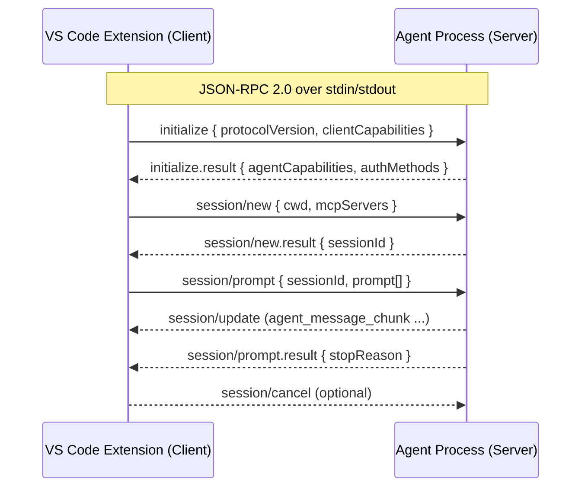

# poc: agent-client-protocol (ACP) vscode extension

This repository contains a proof‑of‑concept (PoC) Visual Studio Code extension that acts as a minimal client for the Agent Client Protocol (ACP).

The goal is to demonstrate end‑to‑end connectivity between VS Code and an ACP‑speaking agent process over stdio, with a small set of commands and client capabilities.

## What is ACP?

ACP standardizes communication between code editors and coding agents. It uses JSON‑RPC 2.0 messages over stdin/stdout. A typical prompt turn looks like:



- initialize → the client and agent exchange capabilities
- session/new → the client creates a session (optionally passing cwd and MCP servers)
- session/prompt → the client sends user input; the agent streams updates (session/update)
- stop reason → the agent returns a final result; the client may send session/cancel to abort

This PoC focuses on the minimal subset required to connect, create a session, and send a prompt.

## What is this PoC?

Minimal VS Code extension that:

- Spawns an ACP‑capable agent as a child process and talks JSON‑RPC over stdio.
- Implements basic client methods: permission requests (Quick Pick UI), read/write text files within the current workspace, and session updates (logged to the Output channel).
- Exposes simple commands to connect, send a prompt, cancel, and manage settings.
- Includes local helper binaries for testing under `tools/`:
  - `tools/mock-agent.js`: a tiny ACP mock agent that echoes text.
  - `tools/claude-acp-agent.js`: a minimal bridge that speaks ACP to the editor and shells out to a local `claude` CLI for responses.

Scope and limitations:

- PoC only; APIs, behaviors, and logs are intentionally simple.
- File operations are limited to absolute paths inside the opened workspace.
- No persistence beyond a single session; minimal error handling.

## Prerequisites

- VS Code 1.88+ (Extension Development Host)
- Node.js 18+ and pnpm
- An ACP‑speaking agent binary; or use the included tools (mock/bridge) for local testing.

## Build and Run (Extension Development Host)

1) Install dependencies

```bash
pnpm install
```

2) Launch the extension

- Open this folder in VS Code.
- Run and Debug → "Debug: Start Debugging" (configured in `.vscode/launch.json`).
- A new Extension Development Host window will open.

3) Open the Output channel named "ACP" to view logs.

## Configuration

Settings (User or Workspace):

- `acp.agentPath` (string): Path to the agent executable (must speak ACP over stdio).
- `acp.agentArgs` (string[]): Optional Arguments to pass to the agent process.
- `acp.mcpServers` (array): Optional MCP server definitions passed during session creation.

You can also set these via commands:

- "ACP: Set Agent Path" — pick the agent executable.
- "ACP: Set Agent Args" — enter JSON array or space‑separated args.
- "ACP: Show Config" — print current settings into the "ACP" Output channel.

Workspace Trust is required. When the workspace is untrusted, the extension blocks agent process launch and file writes.

## Commands

- "ACP: Connect Agent" — spawn the agent and perform initialize → session/new.
- "ACP: Send Prompt" — prompt the agent; results stream to the Output channel.
- "ACP: Cancel Prompt" — send `session/cancel` to abort a running prompt.
- "ACP: Disconnect Agent" / "ACP: Reconnect Agent" — stop/start the child process and session.
- "ACP: Set Agent Path" / "ACP: Set Agent Args" / "ACP: Show Config" — manage configuration.

## Try the PoC

Option A — Use the mock agent (no external tools required)

1) Set the agent path to `tools/mock-agent.js` (it is executable and has a shebang).
2) Leave `acp.agentArgs` empty (`[]`).
3) Run "ACP: Connect Agent" and then "ACP: Send Prompt".
4) You should see `Echo: <your text>` streamed in the "ACP" Output channel.

Option B — Use the Claude bridge (requires a local `claude` CLI)

1) Set the agent path to `tools/claude-acp-agent.js`.
2) Set `acp.agentArgs`, for example:

```json
["--claude-path=/absolute/path/to/claude", "--model=sonnet"]
```

3) Run "ACP: Connect Agent" and then "ACP: Send Prompt".
4) The bridge will run `claude -p --output-format json <prompt>` and stream back a single message chunk.

Notes

- If initialize or newSession time out, your binary likely does not speak ACP over stdio. Use the mock agent or the bridge, or adjust your agent to run in stdio mode.
- File operations only allow absolute paths inside the current workspace. Relative paths or paths outside the workspace are rejected.
- Check the "ACP" Output channel for detailed logs (`[connect]`, `[spawn]`, `[rpc]`, `[agent/stdout|stderr]`).

## Security Considerations

- The extension enforces workspace boundaries for file reads/writes and requires absolute paths.
- External agent processes inherit your environment. Review what you launch via `acp.agentPath`/`acp.agentArgs`.

## Project Structure (high‑level)

- `src/extension.ts` — VS Code activation, commands, ACP wiring, Output logging.
- `@zed-industries/agent-client-protocol` — official ACP TypeScript library (transpiled on build).
- `tools/mock-agent.js` — local mock ACP agent.
- `tools/claude-acp-agent.js` — minimal ACP→Claude bridge agent.

## License

This is a PoC for experimentation and evaluation. No warranty; APIs and behavior may change.
